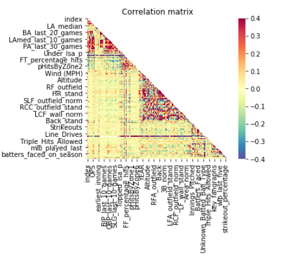
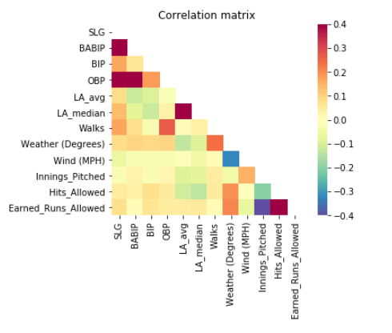
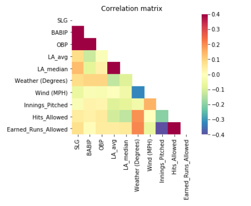

As we seek to try to find the principal set of variables that can optimize the prediction of hits, we find a multitude of different strategies can be uncovered to contribute to this cause.

For beginners, I think dimension reduction and understanding the base variables and how that work together can prove to be a major source of help on this journey to find the principal set of variables.

Finding correlations of the variables and seeing the behavior of all the original variables can help us give us good insight to which variables are of interest in this case.

For the first correlation map we see all the correlations of all the variables using the merged data gathered from resources such as Statcast, Fangraphs, and Baseball Reference.

In this correlation map we find that the variables are scattered for the most part in terms of correlation but have these signficant clusters that seem we can take a look at. But overall all the variables in one map makes it hard to tell how each variables correlates with each other so we will have to cut down more variables to see a good trace of variable behavior.

In this correlation map of all the variables we see there are too many variables to account for.

So the next step was to take a step back and realize which variables from the most basic level are important, and this would include all the base variables of batting, Pitching and Weather. For better understanding here is a list of all the variables included.

**‘SLG’,‘BABIP’,‘BIP’,‘OBP’,‘LA_avg’,‘LA_median’,‘Walks’,‘Venue’,‘Weather (Degrees)’,‘Wind (MPH)’,‘Innings_Pitched’,‘Hits_Allowed’, ‘Earned_Runs_Allowed’**

In this correlation map of all the base variables we see there are some interesting relationships with some variables but not all.

With this newly designed correlation map we see in traces of relationships with the data, but some variables including BIP and Walks proved to not have a significant relationship with any other variable. So we omit those to get a new correlation map

In this correlation map we see a good trace of the behavior vairables of interest given there relationships with the other variables.

In conclusion, these selected variables prove to be worthy for our model. At least at this point…

N.B
