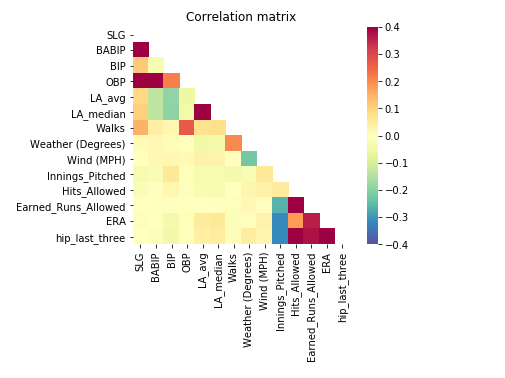
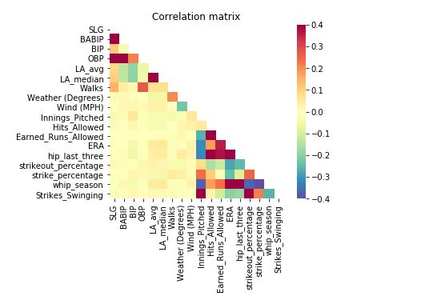
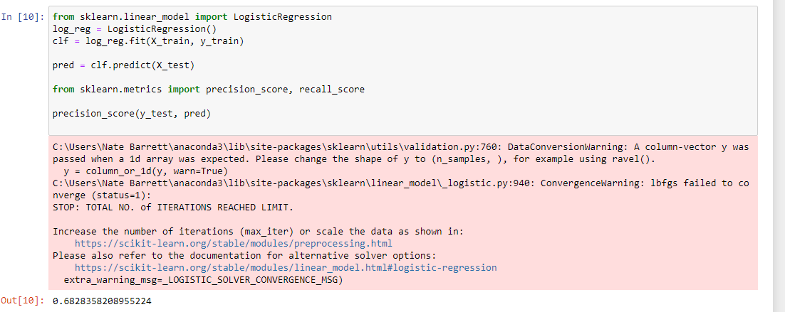
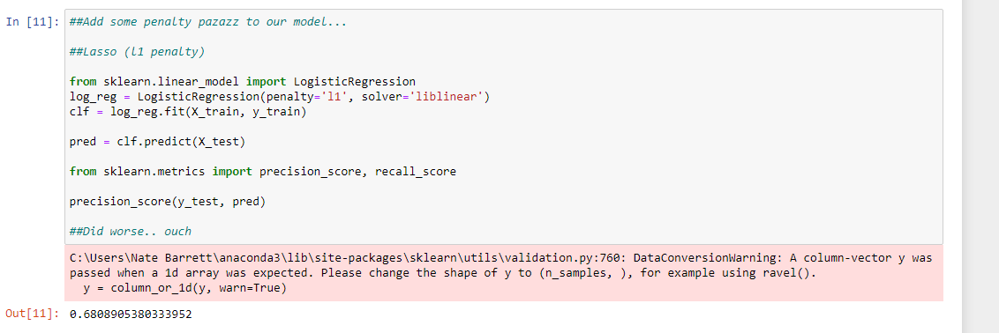
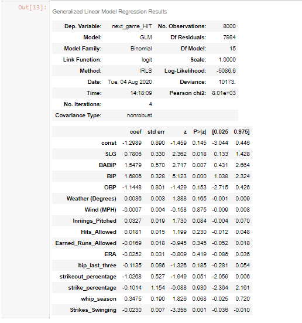

With our previous model being a model created by base variables of baseball, we now look to seek out and find more variables that can help improve the model. We also look to find new model paramters and metrics to use to see if adjusting the paramters of the model itself will make a difference, these adjustemnts include adding a L1 (Lasso) and L2 (Ridge) penalty to our generalized linear model.

We first start by going back to the drawing board of variable selection and feature engineering. I went over the list of variables and consulted with my teammates about additional variables to add to our model and why these variables would contribute to better model performance. After consultation with the project lead he was able to advise to add the **ERA** and **hip_last_three** variables, for these variables would give a better insight to the response variables (projecting a hit) by further including some pitching variables of interest. I went along and ran a correlation map to find out that these additional variables had deep correlation with the base variables already inlcuded in the model. These make these variables signficant to the relative cause of predicting rather of not a player will get a hit, thus they are qualified to go into our model. Correlation can be seen in the graph above. 

After this consultation I did one more check of all the variables included in the dataset to see if there were more variables of interest to add to the model. After a deep search and research into each variable I was able to extract the **strikeout_percentage** , **strike_percentage** , **whip_season** , **Strikes_Swinging** variables also as possible candidates to include in the model. After running a corrrelation test with the vairbales already included I was able to find that these variables also have strong correlation, therefore making each of them qualified to include in the model as well. This can be seen in the graph above. 

We now see that these newly added variables have way more correlation than some variables we originall thought to be fundamental to finding out rather a player will get a hit or not. This motivited action to omit the **Walks** . **LA_avg** , **LA_median** variables from the model. 

With these new variables inserted into our explanatory variable section of our model, it was now time to put our general linear model to the test. After running this model with a signficantly bigger dataset of the original data we see that it yields a .682 precision score, a .082 increase from our original model. These results show that our newly inserted variables made huge dividends in the general linear model's performance. 

We now look to explore the paramters of the model, with a basic generalized linear model being quite impressive, it was now time to look for alternative linear models that might have a better performance. With this in mind I inserted a L1 norm penalty to our linear model, to see if adding a penalty of the model's cost function would cause more outside noise of the variables to be eradicated and thus have a better model performance. After inserting this alternative though we see that the model performs worse than our original base linear model, which can probably be explained by the strong correlation of the variables and lack of outside noise, putting us in a matter of overfitting the model to our data.

To confirm this I added a similar but different alternative model, the L2 norm penalty which acts as a penalty that corrsponds more with the amount of variables in the model than the cost function of the model , however this penalty yielded even worse resuls than our previous two models.

With this it is now clear that the base linear model is the model of choice in this situation given it performed with the highest precision score. We look at the metrics of this linear model and see that almost variables have a very small P>|z| value. This meaning that these variables are signficant to the response variable in the model which means they all play a signficant role in finding out rather a player will get a hit or not against another player on a given day. Progress indeed.  

N.B
