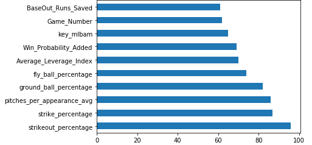

**[<-PREVIOUS PAGE]({{page.previous_}} "previous")** **[NEXT PAGE ->]({{page.next_}} "next")**   

Players in Major League Baseball come with different styles, preferences, and tendencies. Some players are switch-hitters, which means that they are typically agnostic to the way the opposing pitcher throws (usually, hitters perform better against pitchers of the opposite handedness). One player might prefer the humidity of a certain park and loves hitting curveballs. Contrastingly, another player might love playing in dry weather and absolutely despises curveballs! Perhaps we can build a player-specific model that could perform even more accurately than our generalized model. 

To test if this hypothesis was valid, we trained separate Random Forest models (Random Forest was high-performing and not too time intensive but other models such as Logistic Regression would've worked as well) for each player with at least 30 samples (72% of total players in our original dataset met this criteria). We then recorded the most influential features seen in each of the models. Comparing these results to the generalized dataset, we can then figure out if players do, in fact, have different tendencies! If the most important features that show up in the player-specific models are similar to that of the general model, then we wouldn't find as much of a difference between the two models.

As discussed in previous blog posts in the general dataset, the most influential features for a Random Forest model were BIP, BA, and BABIP.

However, when totaling the number of times a certain feature appeared in the top 3 most influential features for each individual player, the following were the most influential features:

The top 3 features were actually strikeout_percentage, strike_percentage, and pitches_per_appearance_avg, none of which were in the top 3 for the general dataset.

The subtle differences in favorable features are compelling enough for us to dive deeper into player-specific models. When observing the most influential features for each player, we noticed that they varied significantly from one another. This can perhaps conclude that each player is unique and that it is worth looking into player-specific models.

  
**[<-PREVIOUS PAGE]({{page.previous_}} "previous")** **[NEXT PAGE ->]({{page.next_}} "next")** 
