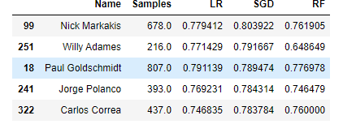

**[<-PREVIOUS PAGE]({{page.previous_}} "previous")** **[NEXT PAGE ->]({{page.next_}} "next")**   

In our previous exploration on player-specific models, we identified that each player is unique in terms of what variables indicate that they will have a strong hitting performance. For this reason, we trained separate Logistic Regression, SGD, and Random Forest models for each individual player with at least 30 samples in our original dataset (72% of players met this criteria). It should be noted that the parameters for the models were only tuned slightly, changing only parameters such as the solver for Logistic Regression and max iterations for Logistic Regression and SGD while other parameters such as the number of estimators for the Random Forest were kept at the default value. Other high-performing models such as Multilayer Perceptron and SVM were not used because they were too time intensive. 

The accuracy of the models were measured in precision because our goal is to predict when a player will get a hit, and we are more concerned with guessing incorrectly that they will get a hit as opposed to guessing incorrectly that they won't. However, it should be noted that our dataset is more positive heavy in the sense that 65% of the recorded data were hits as opposed to misses, so that can greatly affect our precision rate. We balance the dataset later, however, which helps to remedy this issue. The following were the results:

The average precision scores for the three models all hovered around 61-62%, which is about 1-2% lower than the precision scores for the general dataset, which hovered around 63-64%. One interesting thing to note is that Logistic Regression performed the best, then SGD, and finally Random Forest while the order was completely reversed for the general dataset. However, the difference between the models were less than 1%, so they are all very similar.

The following were some of the most predictable players for each model. Some players were very predictable across all models, but there was also some variance in the most predictable players for each model:

Logistic Regression:

Stochastic Gradient Descent:

Random Forest:

When looking at the top 100 precision, we see a much better result with the models scoring in the 83-84% precision range. Logistic Regression performed the worse while Stochastic Gradient Descent performed the best, but the difference between each model was very small:

![t1(./images/top1PNG "t1)

Logistic Regression was able to predict 16 of the 703 players with perfect precision while Stochastic Gradient Descent and Random Forest were able to predict 18 with perfect precision. Taking a look at one specific player who had 58 games recorded in our database, Josh Thole, we see that all 3 models predicted his hitting with perfect precision. This may be due to the fact that Josh was known for having a successful and consistent hitting career, making him more predictable than many other players.

Overall, the model was able to predict some players almost perfectly while others were a lot more difficult to predict. However, the player-specific models make certain players a lot more predictable.

**[<-PREVIOUS PAGE]({{page.previous_}} "previous")** **[NEXT PAGE ->]({{page.next_}} "next")** 
