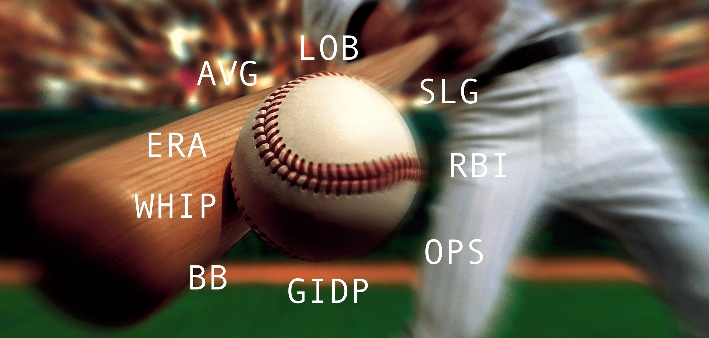

**[<-PREVIOUS PAGE]({{page.previous_}} "previous")****[ABOUT US->]({{page.next_}} "next")**     

We had a blast taking part in this project. Through many hours of data collection, data cleaning, and modeling, we were finally able to produce a really cool end-to-end data science project!

To summarize our project, we decided to see if we could produce a machine learning model that will predict whether a player will produce a base hit or not on any given day. We were initially inpsired by "Beat the Streak" a popular gaming app that allows people to pick up to two players to get a hit every day, and if they are correct 57 times in a row, they will win 5.6 million dollars. 

If guessing by chance on each day, there is a 65 percent chance likelihood a player will get a hit. More often than not, a player does actually produce at least one base hit, which was fairly surprising to see. Although these are good odds, the actual odds of getting a 57 day streak is 1 in 50,000,000,000 (50 billion wowza, very slim!).

We decided to approach the problem in two ways: a generalized player machine learning model and a player-specific one. 

Our best generalized model produced exciting results. A top-100 precision score of 82% was obtained using Logisitic Regression (similar scores were obtained using a MLP). This is almost 20 percent more accurate than luck. In player-specific models, the average score was about 10 percent lower than generalized models (around 60 percent), but we did achieve great accuracy in several instances with particular players. If taken the 82% precision score, our new odds increase to about 1 in 81,772. Even though it is still quite unlikely we could win the jackpot, our odds have increase SIGNIFICANTLY. That's exactly 611,456 times better odds than originally, which is quite amazing.

Overall, we were more successful with generalized models than player specific ones. Both had merit and it was exciting to achieve instances of high precision in both approaches. The upside to the generalized model is that it is more robust to outliers, had a lot of training data, and performed predictably in cross validation tests. The downside is that it may not be as personalized as some player-specific models. Player-specific models are great at finding the tendencies and habits of individual players, although they are suceptible to outliers and usually have a smaller amount of training data, which can produce unreliable results. Although we still have an unlikely chance of winning 5.7 million dollars, a combination of the two approaches would be very fascinating and would seem to be the most successful to "beating the streak".

Future projects could try to explore how to balance these two approaches a bit more, dive into deeper deep learning models, and even obtaining more data. Due to sheer size of our dataset, we omitted hitter-pitcher matchup statistics as well as defensive stats. Adding those extra features could bump our model precision by even more percentage points. Overall, we are very excited by our results and we hope you enjoyed reading about our work!

  
**[<-PREVIOUS PAGE]({{page.previous_}} "previous")****[ABOUT US ->]({{page.next_}} "next")** 
